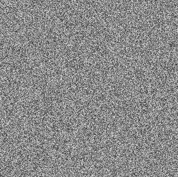
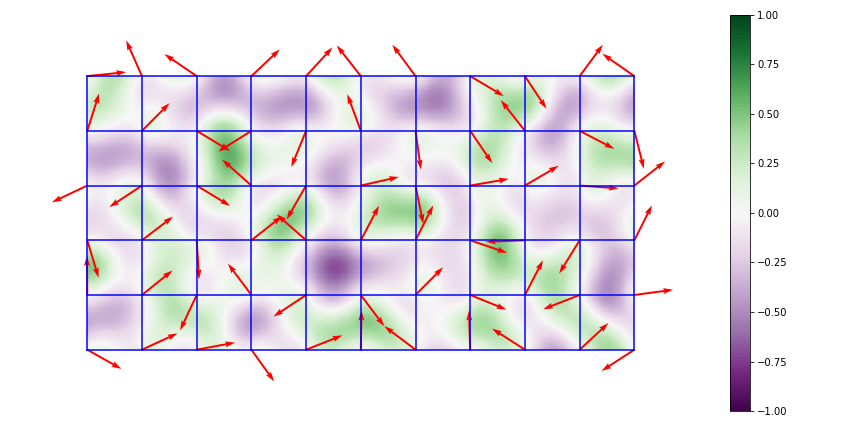

# Random Noise Generation

After failing to find a succient and readable Perlin noise algorithm in Python, I decided to create my own. This goes over the differences between Perlin noise and random noise, as well as document the imporvements I've tried to make to my original algorithm with the power of vectorized functions.

### Using the script

Simply run:

```python
import noise # Both functions output a square array of noisy values normalized from 0-255
noise = noise.Perlin(scale, resolution, seed)
fractal_noise = noise.Octave(resolution, num_of_octaves, major_grid_scale, falloff, seed)
```

Note that when using the octave/fractal noise function, the `major_grid_scale` (formally called lacunarity) determines in part your resolution. The resolution needs to be evenly divisible by $lacunarity^{octaves}$. Typically is you make both the lacunarity and resolution powers of 2 there will be no issue.

### Random noise

<p id="img_cont">
    
    
    
</p>

_Above: the differences between random/white noise (left), Perlin noise (center), and Perlin noise with multiple octaves (right)._

True random noise is the simplest form of noise, but it's surprisingly useless for many circumstances. It has its moments--[like simulating raindrops in my hydraulic erosion simulation](https://github.com/csaddison/Hydraulic-Erosion-Sim)--but for many applications a better choice of distribution or noise algorithm yields more accurate results.

The problem is that many natural phenomena have smooth, continuous changes. They're well-behaved processes: a small shift in the intput results in a small shift in the output: $f(x+\epsilon) \approx f(x) + \epsilon$. Random noise usually has large jumps when moving even a single pixel or other unit. However, it is incredibly easy to implement:

``` python
import numpy as np
noise = 255 * np.random.rand(y_dimension, x_dimension)
```

The prefactor of 255 is used as a convention to create a standard 8-bit image ($2^{8}=256$).

### Perlin noise

_Note: all images in this section are created by Matthewslf and taken from the Wikimedia Commons under [CC BY-SA 4.0](https://creativecommons.org/licenses/by-sa/4.0)._


_Above: the grid structure of gradients._

[Perlin noise](https://en.wikipedia.org/wiki/Perlin_noise) was developed in 1983 by Ken Perlin and takes into account the value of neighboring points to create smooth, undulating patterns. This works by assigning a vector direction to a large underlying grid of lattice points. The number of grid nodes inversely corresponds with the scale of the noise--a higher grid count leads to smaller scaled noise.


_Above: dot products of displacement and gradient vectors._

Then, for every pixel in a cell the algorithm creates a displacement vector between the pixel and the nearest node. It then calculates the dot product of this displacement vector with the the gradient vector of the nearest node.



_Above: values after interpolation._

It then interpolates between adjacent the results, creating smooth transitions between nodes. There are many possible interpolation equations: linear, cubic, sigmoid... the list goes on. The Perlin algorithm uses a quintic interpolation function to avoid artifacts between cells. This is accomplished by requiring the first and second derivatives of the function to vanish at $x=0,1$ so that a constant rate of change of value is achieved:

$$f(x) = 6 x^5 - 15 x^4 + 10 x^3$$

Taking the first and second derivative of this, it is clear that $f'(0) = f''(0) = f'(1) = f''(1) = 0$. That's all that's required to create Perlin noise--one downside of this algorithm is that the node points themselves always have a dot product of zero, which in a range of -1 to 1 means that each node point is always exactly 50% grey. Similar algorithms have been proposed with improvements, most notably [Simplex noise](https://en.wikipedia.org/wiki/Simplex_noise) which is considerably cheaper to render in higher dimensions: $\mathcal{O}(n^2)$ for Simplex versus $\mathcal{O}(n2^n)$ for Perlin.

### Multi-octave noise

Multi-octave Perlin noise, commonly called fractal noise, involves simply rescaling and adding Perlin noise to itself iteratively. Each iteration, called an octave, is rescaled exponentially and added to the previous octave with a reduced weight (called the persistance of the octave). The grid size of the first octave is referred to as the lacunarity and the grid size of subsequent octaves is $lac.^n$ for the $n^{th}$ octave. Generally, keeping the lacunarity as a power of 2 works well, especially for resolutions common to texture maps (512x512, 1024x1024, etc.).

### The power of vectorization

Originally I had written this program using nested for-loops, looping over every grid point as well as every pixel. This was excruciatingly slow with large grids and high resolutions. After learning about vectorizing functions in numpy I realized this could be sped up considerably. After vectorization the script runs ~30x faster than before.