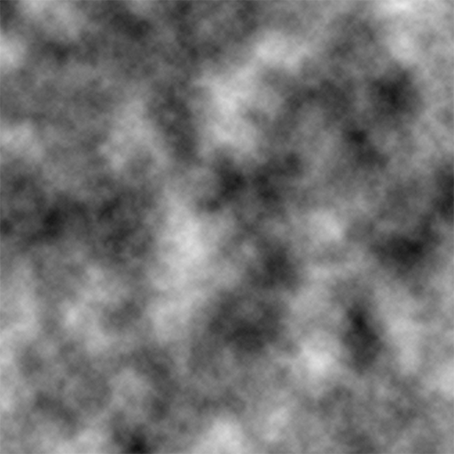

# Random Noise Generation

    
    
    

_Above: the differences between random/white noise (left), Perlin noise (center), and Perlin noise with multiple octaves (right)._

After failing to find a succient and readable Perlin noise algorithm in Python, I decided to create my own. This goes over the differences between Perlin noise and random noise, as well as document the imporvements I've tried to make to my original algorithm with the power of vectorized functions.

### Random Noise

True random noise is the simplest form of noise, but it's surprisingly useless for many circumstances. It has its moments--[like simulating raindrops in my hydraulic erosion simulation](https://github.com/csaddison/Hydraulic-Erosion-Sim)--but for many applications a better choice of distribution or noise algorithm yields more accurate results.

The problem is that many natural phenomena have smooth, continuous changes. They're well-behaved processes: a small shift in the intput results in a small shift in the output: $f(x+\epsilon) \approx f(x) + \epsilon$. Random noise usually has large jumps when moving even a single pixel or other unit. However, it is incredibly easy to implement:

~~~ python
import numpy as np
noise = 255 * np.random.rand(y_dimension, x_dimension)
~~~

The prefactor of 255 is used as a convention to create a standard 8-bit image ($2^{8}=256$).

### Perlin Noise

[Perlin noise](https://en.wikipedia.org/wiki/Perlin_noise) was developed in 1983 by Ken Perlin and takes into account the value of neighboring points to create smooth, undulating patterns. This works by assigning a vector direction to a large underlying grid of lattice points . Then, for every pixel the algorithm calculates the dot product between the pixel and the nearest node. It then interpolates between adjacent the results, creating smooth transitions between nodes. One downside of this algorithm is that the node points themselves always have a dot product of zero, which in a range of -1 to 1 means that each node point is always exactly 50% grey.
